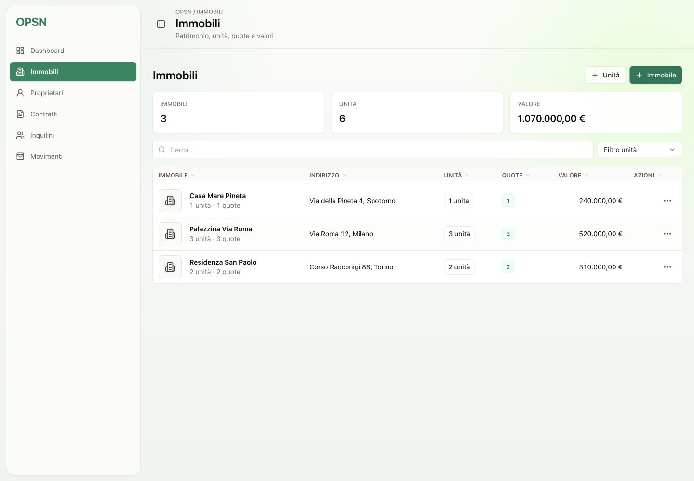

# Immobili

La sezione Immobili gestisce il patrimonio: fabbricati, unita, valori economici e quote di proprieta.

## Cosa permette di fare

- Cercare immobili per nome o indirizzo.
- Filtrare immobili con o senza unita.
- Creare, modificare ed eliminare immobili.
- Registrare indirizzo, valore di acquisto, mutuo, spese condominiali e note.
- Aprire il dettaglio di un immobile.
- Gestire le unita collegate: appartamenti, garage, locali commerciali o altre tipologie.
- Consultare statistiche collegate ai movimenti dell'immobile.
- Gestire quote proprietarie su immobile o singola unita.

## Dati collegati

Gli immobili sono collegati a unita, contratti, movimenti e quote. Questa relazione consente di calcolare competenza, cassa e ripartizioni per proprietario.

## Valore operativo

E la base anagrafica del gestionale: senza immobili e unita non si possono costruire correttamente contratti, movimenti e report.
